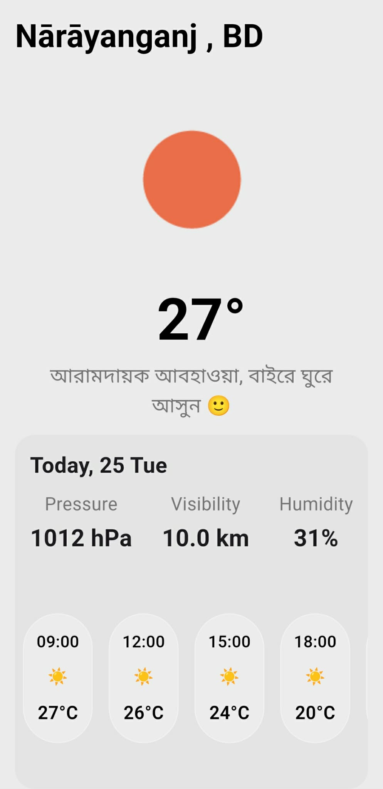

# skypulse

Lightweight, localised weather app built with Flutter — focused on Bangladesh weather and UX-friendly Bengali messages.



## Table of contents

- [Overview](#overview)
- [Features](#features)
- [Screenshots](#screenshots)
- [Requirements](#requirements)
- [Install & Run (Windows)](#install--run-windows)
- [Configuration](#configuration)
- [Project structure](#project-structure)
- [Contributing](#contributing)
- [License](#license)

## Overview

skypulse displays current weather and short-term forecast using OpenWeatherMap. It includes localized Bengali messages and a clean, mobile-first UI designed for users in Bangladesh.

## Features

- Current weather (temperature, humidity, pressure, visibility)
- 3-hour forecast cards
- Bengali (Bangla) user messages and emojis for local feel
- Uses device location (Geolocator)
- Simple, modern UI with light styling

## Screenshots

Save a preview image to `assets/images/preview.png` and include it in `pubspec.yaml` (see Configuration). Example screenshot shown above.

## Requirements

- Flutter (stable) — follow https://flutter.dev/docs/get-started/install
- Dart SDK >= 3.9.0 (as declared in `pubspec.yaml`)
- Android/iOS emulator or physical device
- OpenWeatherMap API key (free tier works)

## Install & Run (Windows)

1. Clone the repo:

   ```powershell
   git clone <repo-url>
   repo-url => "https://github.com/tasnimul1331/skypulse-weather-app-flutter.git"
   ```

2. Get packages:

   ```powershell
   flutter pub get
   ```

3. Connect a device or start an emulator, then run:

   ```powershell
   flutter run
   ```

4. To build release APK:
   ```powershell
   flutter build apk --release
   ```

## Configuration

1. Add your OpenWeatherMap API key:

   - Option A: Edit `lib/services/weather.dart` and replace the `apiKey` constant value.
   - Option B (recommended): use a `.env` / secrets workflow (e.g., flutter_dotenv) to avoid committing keys.

2. Add the preview image to project and register it in `pubspec.yaml`:
   ```yaml
   flutter:
     assets:
       - assets/images/preview.png
   ```

## Project structure (important files)

- lib/
  - main.dart — app entry
  - screens/
    - loading.dart — initial loader & location fetch
    - weather_screen.dart — main UI
  - services/
    - location_service.dart — geolocation wrapper
    - network.dart — HTTP calls
    - weather.dart — OpenWeatherMap logic & localized messages
  - constent.dart, resuable_content.dart — UI constants & reusable widgets

## Notes

- The app uses the metric system (°C) by default.
- Bengali messages are already implemented in `getMessage` inside `lib/services/weather.dart`. Adjust temperature thresholds or translations there as needed for local accuracy.

## Contributing

- Keep PRs focused and small.
- Run `flutter analyze` and `flutter test` (if tests added) before submitting.
- Open issues for feature requests or bugs.

## Troubleshooting

- Location permission denied: ensure app has location permission on the device.
- Incorrect temperature or API errors: confirm the API key and network connectivity.

## License

This project is provided under the MIT License. See LICENSE file for details.
